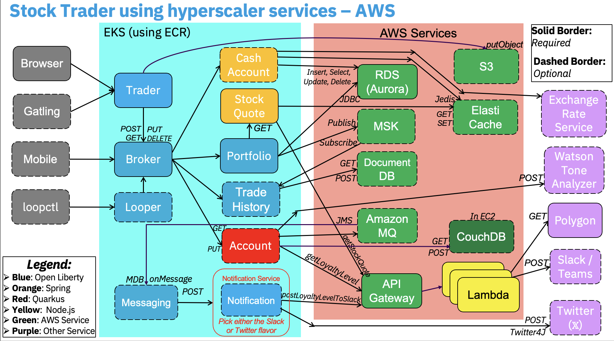

# IBM Stock Trader operator
This operator is intended to install all of the microservices from the IBM Stock Trader sample, and configure them to talk to services they require.

Note it does NOT install such prereqs, like DB2 or MQ - it just asks you to tell it how to connect to such services you already have - whether they be running in the same Kube cluster, or out in a public cloud. See the sibling [stocktrader-setup](https://github.com/IBMStockTrader/stocktrader-setp) repository for Terraform/OpenTofu scripts to set up the prereqs.

It is a follow-on to the helm chart I created earlier, and described at https://medium.com/cloud-engagement-hub/using-an-umbrella-helm-chart-to-deploy-the-composite-ibm-stock-trader-sample-3b8b69af900d.


Initially created for IBM Cloud, we've since tested it in each of the major hyperscalers (AWS, Azure and GCP).  



This repository contains the results of using the Operator SDK to turn the umbrella helm chart (in the sibling `stocktrader-helm` repo - which must be built first, via `helm package stocktrader` in that repo) into a Kubernetes Operator.
The SDK was installed to my Mac via `brew install operator-sdk`, which gave me v0.15.0.  I ran the following command to create the contents of this repo:
```
operator-sdk new stocktrader-operator --api-version=operators.ibm.com/v1 --kind StockTrader --type helm --helm-chart ../stocktrader-helm/stocktrader-1.3.0.tgz
```
Mostly I followed the instructions here: https://docs.openshift.com/container-platform/4.3/operators/operator_sdk/osdk-helm.html

The operator is built by going to the `stocktrader-operator` subdirectory and running the following command:
```
operator-sdk build stocktrader-operator
```
This produces a `stocktrader-operator:latest` Docker image, which I then pushed to the GitHub Container Registry via the following usual commands (if building yourself, you'll need to push to somewhere that you have authority, and will need to update the `operator.yaml` to reference that location):
```
docker tag stocktrader-operator:latest ghcr.io/ibmstocktrader/stocktrader-operator:latest
docker push ghcr.io/ibmstocktrader/stocktrader-operator:latest
```
The results of building this repo are in GHCR, [here](https://github.com/IBMStockTrader/stocktrader-operator/pkgs/container/stocktrader-operator)

## Installing the Operator via the CLI
The prequisites to the following commands require a Mac with Homebrew installed. It also assumes you are logged in to your cluster.

If your cluster does not have OLM already installed. You first need to install the Operator SDK using:
```
brew install operator-sdk
```
Next, you need to run the following command to install OLM:
```
operator-sdk olm install
```
For futher details on installing OLM, refer to their [home page](https://olm.operatorframework.io/docs/getting-started/).

We then run the operator bundle using:
```
operator-sdk run bundle ghcr.io/ibmstocktrader/stocktrader-operator-bundle:v1.0.0
```

Now you should have the OLM-enabled Stock Trader operator running in the cluster. With the operator, you can install an instance of Stock Trader using:
```
kubectl apply -f <Your Stocktrader CR Yaml>
```
An example of the CR yaml can be viewed [here](https://github.com/IBMStockTrader/stocktrader-operator/blob/master/config/samples/operators_v1_stocktrader.yaml).

The operator also automatically provisions a load balancer for trader. Use:
```
kubectl get svc
```
and copy the external IP endpoint with the name ending in `trader-service` to access the application.

In a browser, enter the url in this format: `https://<trader-service-url>:9443/trader`

The following page should pop up:

Congratulations, you have used the operator to install and configure and access the Stock Trader application!
